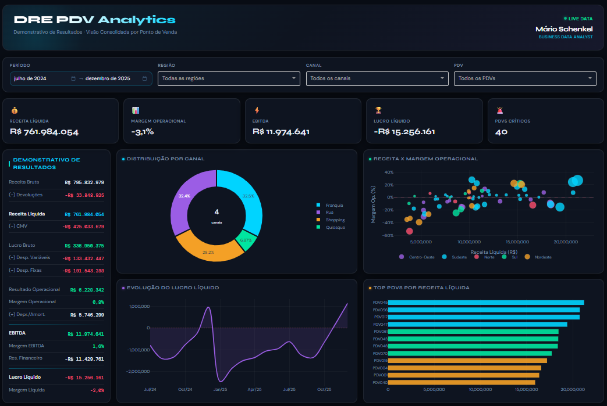

# DRE PDV Analytics: Pipeline ETL + Dashboard Interativo

Este repositório apresenta uma solução completa de **análise de rentabilidade por Ponto de Venda**, cobrindo desde a ingestão e tratamento dos dados até a entrega de um dashboard executivo interativo. O projeto une duas camadas complementares no mesmo fluxo:

* **Notebook de ETL e diagnóstico** para construção da base analítica de DRE, identificação de PDVs críticos e geração automatizada de planos de ação.
* **Dashboard web interativo** para exploração visual dos resultados, com filtros por período, região, canal e PDV.

O resultado é uma visão de ponta a ponta: da camada de dados até a interface de decisão, com foco em responder qual PDV precisa de atenção, por qual motivo e com qual ação recomendada.

## Dashboard Interativo

Clique na imagem abaixo para abrir a versão [interativa do dashboard](https://huggingface.co/spaces/Schenkel99/dre-pdv-analytics):

*Dashboard interativo com DRE consolidado, KPIs de rentabilidade, evolução temporal, comparativo regional e tabela de PDVs críticos com planos de ação.*

---

## Inteligência do Projeto

O projeto foi estruturado como uma jornada analítica em duas etapas encadeadas, cobrindo da matéria-prima até a recomendação acionável.

### 1. Construção da Base Analítica

O ponto de partida são cinco arquivos CSV com dados cadastrais e financeiros mensais por PDV:

* **Cadastro de PDVs** com região, canal e data de abertura.
* **Vendas mensais** com receita bruta, receita líquida e devoluções.
* **Custos variáveis** com CMV, impostos e comissões.
* **Custos fixos** com aluguel, folha, energia e tecnologia.
* **Metas orçamentárias** com receita-alvo, margem-alvo e orçamento mensal.

Após padronização, validação de qualidade e consolidação por `(id_pdv, mes)`, a cascata de resultados do DRE é calculada para cada linha: lucro bruto, EBITDA, lucro operacional e lucro líquido, com as respectivas margens.

### 2. Diagnóstico e Priorização

Com a base analítica construída, três flags de alerta são calculadas por período e PDV:

* **Margem operacional abaixo de 10%**
* **Queda de receita igual ou superior a 20% em relação ao mês anterior**
* **EBITDA negativo**

Um `score_alerta` de 0 a 3 agrega as flags e serve de insumo para a priorização. Em seguida, o driver principal de queda de rentabilidade é identificado para cada PDV entre três categorias: `fixo_alto`, `devolucoes_altas` e `ticket_baixo`. A seleção usa scores normalizados pelos respectivos percentis da base.

### 3. Planos de Ação Automatizados

Com base no driver identificado e no nível de risco (`alta`, `media`, `baixa`), cada PDV recebe de uma a três recomendações de um catálogo estruturado de ações. Cada recomendação inclui categoria, descrição objetiva e prazo estimado de execução em dias.

A base final — `dre_pdv_mensal_consolidado_com_acoes.csv` — consolida DRE, diagnóstico e planos de ação por PDV e é o único artefato consumido pelo dashboard.

### 4. Dashboard para Análise e Decisão

O dashboard transforma a base final em uma interface executiva e operacional com:

* **KPIs consolidados**: receita líquida, margem operacional, EBITDA, lucro líquido e total de PDVs críticos.
* **DRE resumido** com cascata de resultados do período filtrado.
* **Evolução temporal** do lucro líquido por região.
* **Distribuição de receita** por canal.
* **Comparativo receita x margem** por PDV em scatter plot.
* **Ranking dos Top PDVs** por receita líquida.
* **Mapa do Brasil** com desempenho agregado por região.
* **Composição de resultado** por região em gráfico de barras empilhadas.
* **Tabela de PDVs Críticos** com planos de ação, ordenada por prioridade e score de alerta, com tooltips de recomendações completas.

---

## Arquitetura da Solução

O fluxo do projeto pode ser resumido da seguinte forma:

1. **Dados brutos** (cadastro, vendas, custos, metas) são ingeridos e validados.
2. **Pipeline ETL** consolida, calcula métricas e gera flags de alerta.
3. **Camada de diagnóstico** identifica drivers de queda e prioridade de risco por PDV.
4. **Camada de recomendações** vincula planos de ação à base analítica.
5. **Dashboard** consome a base final para exploração visual e suporte à decisão.

---

## Tecnologias e Ferramentas

* **Linguagem**: Python
* **Processamento e análise**: Pandas, NumPy
* **Aplicação web**: Dash, Plotly, Flask
* **Deploy**: Hugging Face Spaces
* **Visual Analytics / UX**: Dashboard Dark SaaS customizado com CSS inline

---

## Estrutura de Arquivos

* [`dre_pdv_pipeline.ipynb`](./dre_pdv_pipeline.ipynb): notebook principal com ETL, cálculo de métricas, diagnóstico de drivers e geração dos planos de ação.
* [`app.py`](./app.py): aplicação web do dashboard interativo.
* [`requirements.txt`](./requirements.txt): dependências da aplicação.
* `dre_pdv_mensal_consolidado_com_acoes.csv`: base final consumida pelo dashboard, com DRE completo, diagnóstico e planos de ação por PDV.
* [`dre-pdv.png`](./dre-pdv.png): imagem de preview do dashboard.

---

## Valor de Negócio

Mais do que calcular rentabilidade, este projeto foi pensado para responder a uma pergunta prática:

**Quais PDVs estão em situação crítica, qual é o principal driver de queda e qual ação deve ser tomada primeiro?**

Com isso, a solução ajuda a:

* identificar os PDVs que mais pressionam o resultado da operação;
* entender se a causa está em custo fixo alto, devolução elevada ou ticket baixo;
* priorizar a ação pelo nível de risco calculado;
* entregar uma recomendação concreta e com prazo para cada PDV crítico.

---

## Autor

**Mário Schenkel** - Data Specialist

* [Meu Portfólio](https://schenkel94.github.io/portfolio/)
* [LinkedIn](https://www.linkedin.com/in/marioschenkel/)
